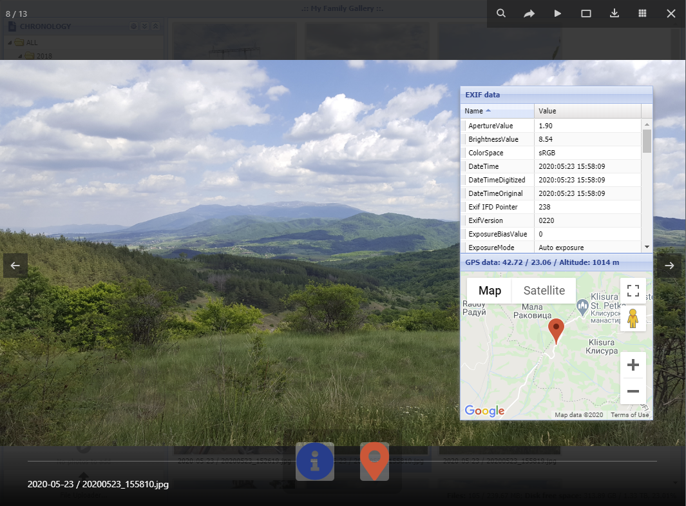
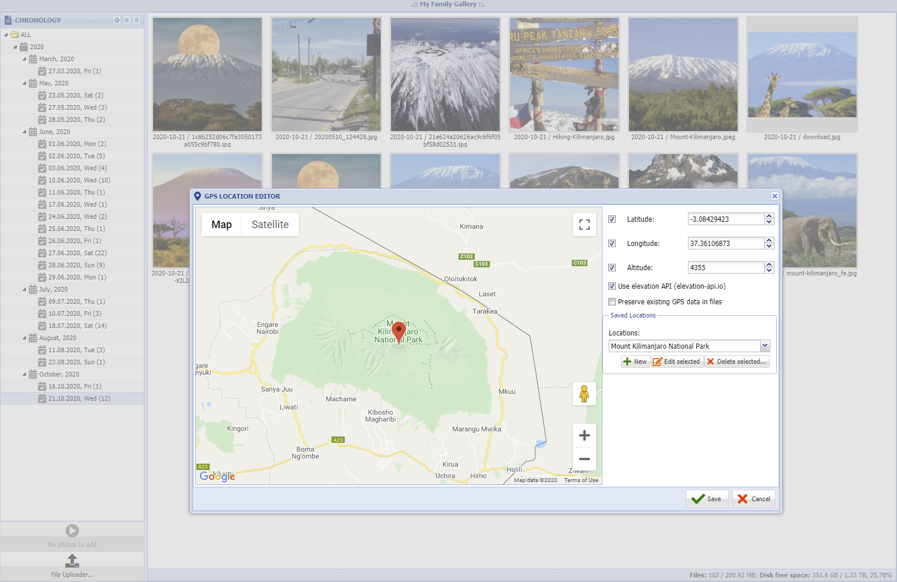

ExtJS Photo Gallery
-------------------------------------





**Source at GitHub**

[https://github.com/wencywww/ExtJS-Photo-Gallery.git](https://github.com/wencywww/ExtJS-Photo-Gallery.git)


**FEATURES:**

  * Organize and browse your photos/videos in a hierarchical (tree) view using browser
  * Items are automatically arranged by Year, Month and Day based on the EXIF information (if available)  
  * The data view can display items for particular day/month/year or all available items
  * Slideshow available via jquery/fancybox
  * Photo geographical locations (latitude/longitude/altitude) can be fine-tuned if needed via intuitive Google Maps-based editor 
  * The EXIF data and location of the currently active slide can be visualised using a grid & Google Maps panel (using [ExifReader](https://github.com/mattiasw/ExifReader) JS library)
  * File uploading via the [DropZone.js](https://www.dropzonejs.com/)
  * Automatic thumbnail creation
  * Ability to delete, rotate and change the date of the item/items manually
  * Ability to recursively traverse the uploads directory for photos/videos in subdirs 
  * Ability to show only videos or only photos 
  * Ability to paginate large dataviews
  * Photos with GPS data can be indicated on the thumbnails
  * The GUI supports English and Bulgarian Language
  * **No database required!**

 
**INSTALLATION**

  * **Requirements**
    * Linux/Windows-based PC (instructions below use Raspbian Buster and a Raspberry Pi board)
    * Apache webserver (nginx is also supported)
    * PHP => 7.1.3 (instructions below use php 7.3) with the GD extension
    * A valid Google API Key with access to Maps JavaScript API, [get your own here](https://developers.google.com/maps/documentation/javascript/get-api-key)
    * Recommended browser versions: Chrome/Edge Chromium => v.81; Firefox => v.77; Opera => v.68 
    for proper image orientation (see Orientation issues section below)
  
  * **Image orientation issues**
        
      Image orientation issues can occur on certain browsers during the slideshow 
      because we now preserve the EXIF information in the photos.
      Chrome (81 and up), Firefox (77 and up) and Opera (68 and up) respect the Orientation EXIF tag 
      (trough the `image-orientation: from-image` CSS rule applied by default) and render the files correctly rotated 
      within the IMG elements. That was not the case with the older version of these browsers 
      (the rule default was `image-orientation: none`), 
      which can result in a 
      situation where the thumbnail is fine, but the actual image is displayed incorrectly rotated 
      if the Orientation tag is different from `top-left`. 
      
      The thumbs should be fine as they are auto-rotated by the Imagine library during the processing of the files.
      
      In short, use Chrome=>81 / FF=> 77 / Opera => 68 and you should be fine. 
  
  * **Sample steps on Raspbian**
  
    ````
    sudo apt update
    sudo apt upgrade
    sudo apt install git apache2 php php-gd
    ````
    
    Instruct Apache to parse PHP code within the HTML files:
    ````
    sudo nano /etc/apache2/mods-available/php7.3.conf
    ````    
    
    Insert the following code after the first FilesMatch directive:
    ````
    <FilesMatch ".+\.html$">
        SetHandler application/x-httpd-php    
    </FilesMatch>
    ````      
    And continue with:
    ````
    sudo apachectl restart
    sudo chown -R pi:pi /var/www/html
    cd /var/www/html
    git clone https://github.com/wencywww/ExtJS-Photo-Gallery.git .
    sudo chmod -R 777 /var/www/html/data/photos
    sudo chmod -R 777 /var/www/html/data/upload
    ````
    
    By default, the gallery runs within the root directory of the virtual host. 
    If it should live in a subdirectory instead, for example /var/www/html/gallery, the variable **$glob['paths']['appRootPrefix']** should be adjusted this way:
    ````
    nano /var/www/html/inc/globals/paths.inc.php
        
    //should be empty if the application is running on a separate virtual host, or string with a leading slash if it lives in a subdirectory, e.g. "/gallery"
    //$glob['paths']['appRootPrefix'] = "/gallery";
    $glob['paths']['appRootPrefix'] = "";
    ````
    
    Set your timezone and change the default username/password. Enter your Google Maps API key (see requirements section above) if you want to show the map panel with the position of the currently visible slide:
    ````
    nano /var/www/html/inc/globals/globals.inc.php
    
    The settings are kept in the following rows:
    ini_set('date.timezone', 'Europe/Sofia');
    $glob['usr'] = "admin";
    $glob['pass'] = "admin";
    //place your own GMaps API key here
    $glob['gmapsApiKey'] = "place-your-own-api-key-here";
    ````


**Usage**

  * Login with the GUI using your browser
  * Use the File Uploader button (bottom left) to upload files via the GUI or manually upload some photos/videos via SFTP/FTP/Samba within `/var/www/html/data/upload` directory making sure they are writable by the webserver
  * The New Files button in the bottom left of the screen should indicate the number of the new items
  * Click the button. The system will process photos, will refresh the tree above and will delete the originals from the upload directory
  * Use the tree nodes to view the items
  * If case of viewing many photos + videos on a single screen - use view pagination trough the gear icon
  * Double click an item to start the fancybox slideshow
  * When the fancybox slideshow is active, the EXIF data presence is auto-detected and can be displayed using the 2 icons from the launcher on the bottom center (it is automatically hidden/shown depending on the EXIF presence for the current slide). 
  * EXIF text data and GPS coordinates are displayed using a property grid and Google Maps panel on the right side of the screen. Both can be toggled on/off by clicking the launcher icons.
  * Both the launcher and the visualisation components can be dragged on the screen. The visualisation container can be resized.
  * Displaying the EXIF information can be switched off using the Settings menu on the top of the tree
  * Sort items asc/desc using the two arrow buttons on the top of the tree panel 
  * To delete items - select them (using shift key), right click and choose "Erase selected.."
  * To change the date for items - select them, right click and choose "Change date..". This can be done for an entire day also - just right click the tree node for the day on the left
  * To rotate items - select them, right click and choose the desired rotation angle (this does not affect videos)
  * To edit GPS location data for your photos, select them on the right (or entire day from the tree), right click and choose "GPS Data" from the menu. The GPS editor (on the third screenshot above) is a great way to add/edit location info for your old photos, which may lack it. 
  

**List of Changes**

  * **2025-08-02**, Added gallery pagination feature - allows the items to be viewed in a small sets in case of bad computer/browser performance is experienced with many files on the screen simultaneously (default - no pagination)
  * **2025-08-02**, Photos and videos can be seen simultaneously or separately (default - both are shown)
  * **2025-08-02**, Photos with GPS data within exif can be visually indicated using a red marker in the bottom-right on the thumbnail (default - on)
  * **2025-08-02**, Autoplay of the videos can be turned on/off on the thumbs (default - off)
  * **2020-10-21**, Implemented GPS Editor component for easy visual manipulation of the location data for your files. Location can be fine-tuned manually via form-fields for exact coordinates or automatically via Google Maps Marker. Altitude can also be set manually or automatically via the elevation-api.io service (precision is 5 km for the free version). The editor allows for **SEPARATE** manipulation of the altitude/longitude/altitude information (for example, you may only change the longitude of the selected photos), can be set to **preserve existing data** (updates only the files which do not have the appropriate info) or to forcibly update it. In additon, the component can save your **favorite locations** for later use via a combobox. That's convenient way to add location information for very old photos (when your camera did not have location services), or simply when your GPS device was turned off somehow      
  * **2020-10-21**, Minor fixes. Get rid of silk-icons, replaced it with Font Awesome icons
  * **2020-05-27**, Added requirement for php version, the minimum supported one is now 7.1.3, requirement for Symfony\Filesystem
  * **2020-05-27**, Removed public Google API Key, the user should provide a new one
  * **2020-05-27**, The EXIF data is now preserved and can be visualised on the screen
  * **2020-04-14**, added support for autoplay for video files (audio muted) instead of the static thumbnail
  * **2020-04-02**, added uploader component via DropZone.js, and some styling via Font Awesome, updated symfony/http-foundation to v. 4.4.7
  * **2018-03-10**, initial commit
