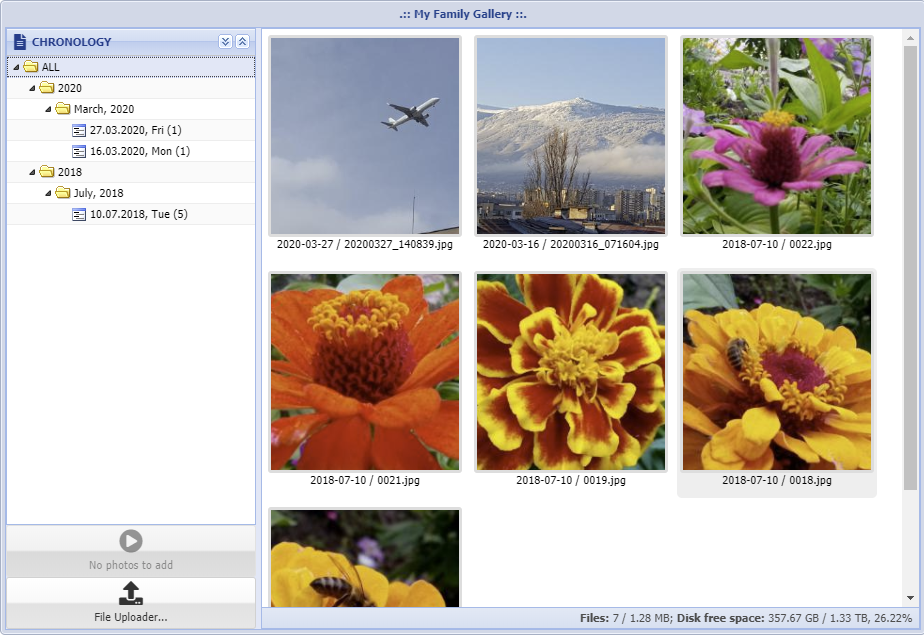

ExtJS Photo Gallery
-------------------------------------




**Source at GitHub**

[https://github.com/wencywww/ExtJS-Photo-Gallery.git](https://github.com/wencywww/ExtJS-Photo-Gallery.git)


**Features:**

  * Organize and browse your photos/videos in a hierarchical (tree) view using browser
  * Items are automatically arranged by Year, Month and Day based on the EXIF information (if available)  
  * The data view can display items for particular day/month/year or all available items
  * Slideshow available via jquery/fancybox
  * Automatic rotation and thumbnail creation
  * Ability to delete, rotate and change the date of the item/items manually
  * Ability to recursively traverse the uploads directory for photos/videos in subdirs
  * No database required
  * The GUI supports English and Bulgarian Language


**Cons:**

  * The EXIF information is NOT PRESERVED and removed after the items are processed
  * There is no support for uploading the images via the GUI (you have to upload them within the data/uploads directory via FTP/Samba)
  * There is no support for thumbnails for the videos (a fixed one is used)

 
**Installation**

  * **Requirements**
    * Linux/Windows-based PC (instructions below use Raspbian Buster and a Raspberry Pi board)
    * Apache webserver (nginx is also supported)
    * PHP 7.x (instructions below use php 7.3)
  
  * **Sample steps on Raspbian**
  
    ````
    sudo apt update
    sudo apt upgrade
    sudo apt install git apache2 php php-gd
    ````
    
    Instruct Apache to parse PHP code within the HTML files:
    ````
    sudo nano /etc/apache2/mods-available/php7.3.conf
    ````    
    
    Insert the following code after the first FilesMatch directive:
    ````
    <FilesMatch ".+\.html$">
        SetHandler application/x-httpd-php    
    </FilesMatch>
    ````      
    And continue with:
    ````
    sudo apachectl restart
    sudo chown -R pi:pi /var/www/html
    cd /var/www/html
    git clone https://github.com/wencywww/ExtJS-Photo-Gallery.git .
    sudo chmod -R 777 /var/www/html/data/photos
    sudo chmod -R 777 /var/www/html/data/upload
    ````
    Set your timezone and change the default username/password:
    ````
    nano /var/www/html/inc/globals/globals.inc.php
    
    The settings are kept in the following 3 rows:
    ini_set('date.timezone', 'Europe/Sofia');
    $glob['usr'] = "admin";
    $glob['pass'] = "admin";   
    ````


**Usage**

  * Login with the GUI using your browser
  * Upload some photos/videos via SFTP/FTP/Samba within `/var/www/html/data/upload` directory making sure they are writable by the webserver
  * Return to the GUI, the button in the bottom left of the screen should indicate the number of the new items
  * Click the button. The system will process photos, will refresh the tree above and will delete the originals from the upload directory
  * Use the tree nodes to view the items
  * Double click an item to start the fancybox slideshow
  * Sort items asc/desc using the two arrow buttons on the top of the tree panel 
  * To delete items - select them (using shift key), right click and choose "Erasing.."
  * To change the date for items - select them, right click and choose "Change Date..". This can be done for an entire day also - just right click the tree node for the day on the left
  * To rotate items - select them, right click and choose the desired rotation angle (this does not affect videos)
  

**List of Changes**

  * **2018-03-10**, initial commit
